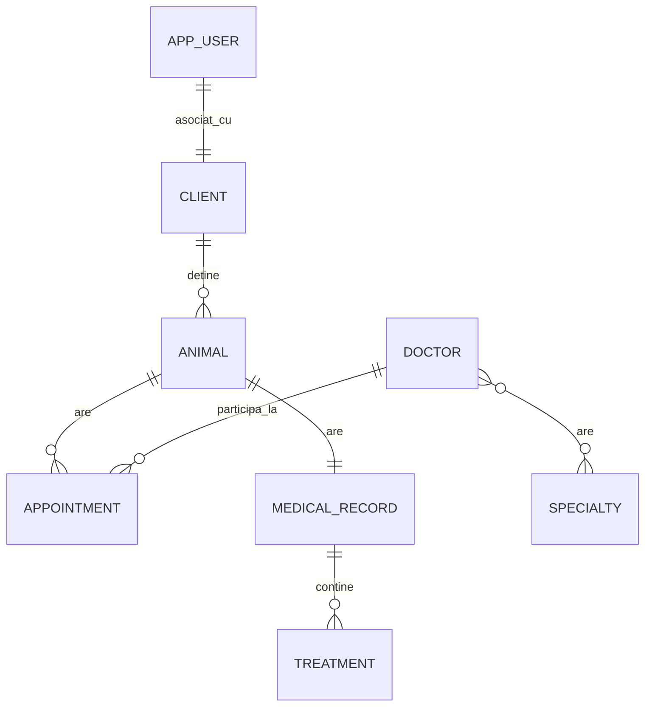

# Vet Clinic

Aplicatie web pentru gestionarea unei clinici veterinare, realizata pentru proiectul de la disciplina AWBD.

## Descriere

Aplicatia permite administrarea entitatilor principale dintr-o clinica veterinara:
- clienti
- animale
- programari
- medici
- fise medicale
- tratamente
- specializari

Aplicatia include autentificare, autorizare pe roluri, validare, paginare, sortare si interfata realizata cu Thymeleaf.

## Tehnologii

- Java 21
- Spring Boot 4.0.3
- Spring MVC
- Spring Data JPA
- Spring Security
- Thymeleaf
- PostgreSQL pentru mediul `dev`
- H2 pentru mediul `test`
- Logback
- Docker Compose

## Model de date

Diagrama ER folosita in proiect:



## Functionalitati principale

- CRUD pentru entitatile principale de business
- cautare, paginare si sortare in liste
- autentificare cu utilizatori din baza de date
- roluri `ADMIN`, `EMPLOYEE`, `USER`
- pagina de login custom
- pagini de eroare custom
- logging in fisiere separate

## Rulare

### Cerinte

- Java 21+
- Docker

### 1. Pornire baza de date

```bash
docker-compose up -d
```

### 2. Rulare aplicatie

Pe Windows:

```bash
.\mvnw.cmd spring-boot:run
```

Pe Linux / macOS:

```bash
./mvnw spring-boot:run
```

Aplicatia porneste implicit cu profilul `dev`.

## Profiluri

- `dev` -> PostgreSQL
- `test` -> H2 in-memory

## Acces

- aplicatie: `http://localhost:8080`
- Swagger UI: `http://localhost:8080/swagger`

## Securitate

- `ADMIN` are acces complet
- `EMPLOYEE` poate gestiona majoritatea entitatilor de business
- `USER` are acces limitat la datele proprii

Aplicatia foloseste:
- autentificare cu Spring Security
- parole codate cu BCrypt
- remember-me
- protectie CSRF

## Logging

Logurile sunt salvate in directorul `logs`:

- `vet-clinic.log`
- `vet-clinic-error.log`

## Observatii

- Profilul `dev` este activ implicit in `application.yml`.
- Configurarea pentru testare este separata in `application-test.yml`.
