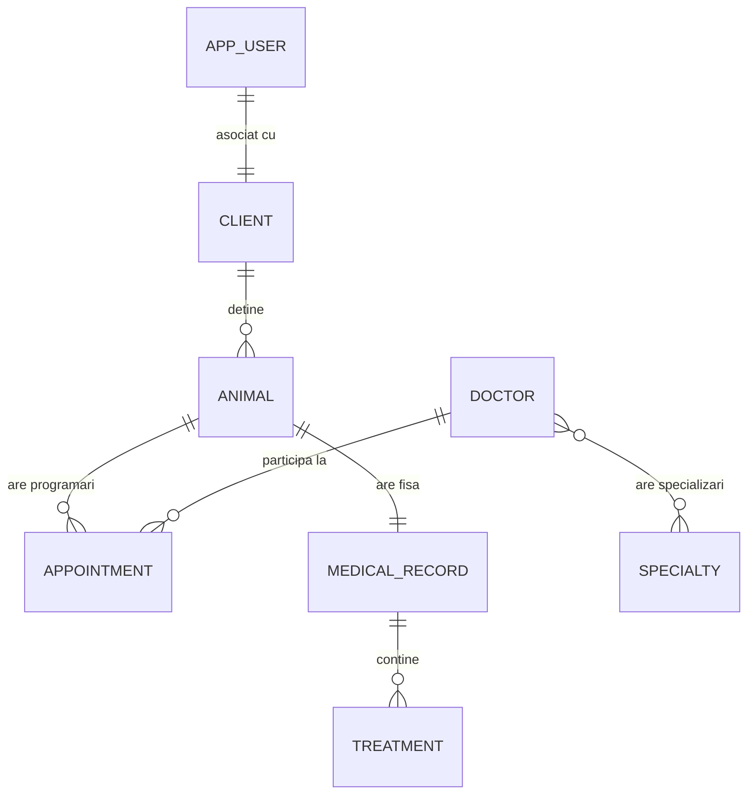

# 🐾 Vet Clinic Management System

O aplicație web modernă pentru gestionarea fluxurilor de lucru într-o clinică veterinară. Proiect realizat pentru cursul
de **Aplicații Web cu Arhitectură de Microservicii**.

## 📖 Descriere

Platforma permite gestionarea completă a unei clinici veterinare, oferind funcționalități pentru medici, angajați și
proprietari de animale. Sistemul automatizează procesele de programare, evidența istoricului medical și gestionarea
tratamentelor.

## 🛠️ Tehnologii Utilizate

- **Backend:** Java 17, Spring Boot 3, Spring Data JPA, Spring Security
- **Frontend:** Thymeleaf, CSS3
- **Bază de date:** PostgreSQL (Dev), H2 (Test)
- **Alte instrumente:** Docker Compose, Lombok, SLF4J/Logback, SpringDoc OpenAPI (Swagger)

## 📊 Model de Date (Diagrama ER)



### Entități Principale:

1. **Client**: Proprietarul animalelor.
2. **Animal**: Pacientul clinicii.
3. **Appointment**: Programări între un animal și un medic.
4. **Doctor**: Personalul medical.
5. **MedicalRecord**: Fișa medicală unică a fiecărui animal.
6. **Treatment**: Tratamente individuale aplicate în cadrul fișei medicale.
7. **Specialty**: Specializările medicilor (ex: Chirurgie, Cardiologie).
8. **AppUser**: Gestionarea autentificării și rolurilor (`ADMIN`, `EMPLOYEE`, `USER`).

## 🚀 Setup și Rulare

### Pre-cerințe

- Java 17+
- Maven
- Docker (pentru PostgreSQL)

### Pași pentru rulare:

1. **Pornirea bazei de date (PostgreSQL):**
   ```bash
   docker-compose up -d
   ```
2. **Rularea aplicației:**
   ```bash
   mvn spring-boot:run
   ```
   *Notă: Profilul `dev` este activat implicit.*

3. **Accesare în browser:**
    - Aplicație: [http://localhost:8080](http://localhost:8080)
    - Swagger UI: [http://localhost:8080/swagger](http://localhost:8080/swagger)

## 🔐 Securitate și Roluri

- **ADMIN**: Acces complet, inclusiv ștergerea entităților critice.
- **EMPLOYEE**: Gestionarea clienților, animalelor, programărilor și fișelor medicale.
- **USER (Client)**: Poate vedea propriile animale, programări și istoricul medical al acestora.

## 📝 Logging

Logurile sunt configurate să fie salvate în directorul `/logs`:

- `vet-clinic.log`: Toate evenimentele de tip INFO/DEBUG.
- `vet-clinic-error.log`: Doar erorile critice pentru o monitorizare rapidă.

---
*Proiect realizat pentru cursul AWBD - 2026*